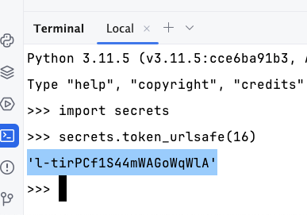

# Working with SQLite databases

COMP0034 2023-24 Week 2 coding activities

## 1. Preparation and introduction

This assumes you have already forked the coursework repository and cloned the resulting repository to your IDE.

1. Create and activate a virtual environment
2. Install the requirements `pip install -r requirements.txt`
3. Run the app `flask --app paralympics/routes run --debug`
4. Open a browser and go to http://127.0.0.1:5000
5. Try it again with http://127.0.0.1:5000/name (replace name with your name)
6. You should see the variable route for the homepage (the final activity from last week)
7. Stop the app using `CTRL+C`

Consider installing the VS Code extension SQLite Viewer to allow you to view the content of a database through the VS
Code interface.

If you are using PyCharm Professional then you can already view database files. You cannot do this in PyCharm Community
edition which is why Professional is recommended.

When you install from requirements.txt this
included [Flask-SQLAlchemy](https://flask-sqlalchemy.palletsprojects.com/en/3.1.x/quickstart/). The SQLAlchemy package
will also be installed as it is a dependency for Flask-SQLAlchemy. Together they provide functionality that lets you
more easily create Python classes that map to database tables; and handles the database interaction, i.e. SQL queries,
using Python functions. This follows a design pattern called ORM, Object Relational Mapper. An ORM encapsulates, or
wraps, data stored in a database into an object that can be used in Python.

Flask-SQLAlchemy works with many database formats but will not work directly with .csv/.xlsx file. You will use SQLite
which stores the tables and data in a single file which is convenient for the coursework.

There are various ways to save csv as sqlite. The following uses libraries you should be familiar with from COMP0035,
namely pandas and pathlib; and introduces some SQLAlchemy code.

## Step 1: Change the Flask app to be created using the Flask application factory pattern

You will create a function that allows you to create a Flask app and then enable that app to use extensions such as
Flask-SQLAlchemy and to add configuration parameters.

This is an [application factory](https://flask.palletsprojects.com/en/2.3.x/patterns/appfactories/) pattern. Like a
factory production line, you create the app, then you pass it along a production line
adding extra features to it as needed.

1. Open `paralympics/__init__.py`
2. Copy the example create_app function from
   the [Flask tutorial](https://flask.palletsprojects.com/en/2.3.x/tutorial/factory/) with minor changes:
    ```python
    import os

    from flask import Flask


    def create_app(test_config=None):
        # create and configure the app
        app = Flask(__name__, instance_relative_config=True)
        app.config.from_mapping(
            SECRET_KEY='dev',
            DATABASE=os.path.join(app.instance_path, 'paralympics.sqlite'),
        )

        if test_config is None:
            # load the instance config, if it exists, when not testing
            app.config.from_pyfile('config.py', silent=True)
        else:
            # load the test config if passed in
            app.config.from_mapping(test_config)

        # ensure the instance folder exists
        try:
            os.makedirs(app.instance_path)
        except OSError:
            pass

        return app
    ```
3. Create your own unique SECRET_KEY.

   SECRET_KEY is used by Flask and extensions to keep data safe. It’s set to 'dev' to provide a convenient value
   during development, but it should be overridden with a random value when deploying.

   DATABASE is the path where the SQLite database file will be saved. It's under app.instance_path, which is the path
   that Flask has chosen for the instance folder.

   You can generate a secret key from the Terminal command line. Type `python3` or `python` and press enter. At
   the `>>>` prompt type `import secrets` and press enter. Then type `secrets.token_urlsafe(16)` and press enter. You
   should see a string of 16 characters. Copy this and use it to replace the word 'dev' in
   the SECRET_KEY line in the `create_app()` function.

   
4. Now that the app is created in the create_app function, you need to modify the `paralympics.py` app to use this.

   You can now use the Flask `current_app` object to access the configured app. Replace the contents with the
   following:

    ```
   from flask import current_app
 
 
   @current_app.route('/')
   def hello():
      return f"Hello!"
   ```
5. Check that you can run the app `flask --app paralympics run --debug`. Flask recognises the create_app function.

## Initialise the SQLAlchemy extension

Create a python file called `model.py`. This will contain classes that map to your database tables.

Add the following code:

```python
from flask_sqlalchemy import SQLAlchemy
from sqlalchemy.orm import DeclarativeBase

class Base(DeclarativeBase):
  pass

db = SQLAlchemy(model_class=Base)
```

## Define a model
Assume that at some point the paralympics app will have authentication and so needs a table to hold user details.
Add the following to `model.py`

https://flask.palletsprojects.com/en/2.3.x/patterns/sqlalchemy/#flask-sqlalchemy-extension

Not the foloowing!

```
from sqlalchemy.orm import Mapped, mapped_column

class User(db.Model):
    id: Mapped[int] = mapped_column(db.Integer, primary_key=True)
    email: Mapped[str] = mapped_column(db.String, unique=True, nullable=False)
    password: Mapped[str] = mapped_column(db.String, unique=True, nullable=False)
```


You will modify the paralympic_app/__init__.py:create_app() code to create a SQLAlchemy object and initialise it for the
app. This will handle the connection to the database

Modify the create_app function to create an instance of SQLAlchemy. There are two ways to do this in the
Flask-SQLAlchemy documentation. Let's use the version that creates the global instance and then initialises it for the
Flask app.

The code below does the following in this order:

before the create_app() create an instance of a Flask-SQLAlchemy object
inside the create_app() function, as soon as you create the app, add configuration parameters that state the location of
the database file.
inside the create_app() initialise the SQLAchemy extension to the Flask app. This will recognise the database location
from the SQLALCHEMY_DATABASE_URI. In the example below the code is called from a function named initialize_extenstions(
app), or your could just replace this line with db.init_app(app) instead.
from pathlib import Path
from flask import Flask
from flask_sqlalchemy import SQLAlchemy
from flask_marshmallow import Marshmallow

# Sets the project root folder

PROJECT_ROOT = Path(__file__).parent

# Create a global SQLAlchemy object

db = SQLAlchemy()

def create_app():
"""Create and configure the Flask app"""
app = Flask(__name__)
app.config["SECRET_KEY"] = "YY3R4fQ5OmlmVKOSlsVHew"

# configure the SQLite database location

app.config["SQLALCHEMY_DATABASE_URI"] = "sqlite:///" + str(
PROJECT_ROOT.joinpath("data", "paralympics.db")
)
app.config["SQLALCHEMY_TRACK_MODIFICATIONS"] = False
app.config["SQLALCHEMY_ECHO"] = True

    # Uses a helper function to initialise extensions
    initialize_extensions(app)

    # Include the routes from routes.py
    with app.app_context():
        from . import routes

    return app

def initialize_extensions(app):
"""Binds extensions to the Flask application instance (app)"""

# Flask-SQLAlchemy

db.init_app(app)
1.3 Define the model classes that will map from the database to Python classes

Create a python file. This is often named models.py but doesn't have to be.

Add the following code to create two classes that represents the data in the database.

The code is explained in more detail below.

from paralympic_app import db

class Region(db.Model):
"""NOC region"""

    __tablename__ = "region"
    NOC = db.Column(db.Text, primary_key=True)
    region = db.Column(db.Text, nullable=False)
    notes = db.Column(db.Text)
    events = db.relationship("Event", back_populates="region")

    def __repr__(self):
        """
        Returns the attributes of the region as a string
        :returns str
        """
        clsname = self.__class__.__name__
        return f"{clsname}: <{self.NOC}, {self.region}, {self.notes}>"

class Event(db.Model):
"""Paralympic event"""

    __tablename__ = "event"
    event_id = db.Column(db.Integer, primary_key=True)
    type = db.Column(db.Text, nullable=False)
    year = db.Column(db.Integer, nullable=False)
    location = db.Column(db.Text, nullable=False)
    lat = db.Column(db.Text)
    lon = db.Column(db.Text)
    NOC = db.Column(db.Text, db.ForeignKey("region.NOC"), nullable=False)
    start = db.Column(db.Text, nullable=False)
    end = db.Column(db.Text, nullable=False)
    disabilities_included = db.Column(db.Text, nullable=False)
    events = db.Column(db.Text, nullable=False)
    sports = db.Column(db.Text, nullable=False)
    countries = db.Column(db.Integer, nullable=False)
    male = db.Column(db.Integer, nullable=False)
    female = db.Column(db.Integer, nullable=False)
    participants = db.Column(db.Integer, nullable=False)
    highlights = db.Column(db.Text)
    region = db.relationship("Region", back_populates="events")

    def __repr__(self):
        """
        Returns the attributes of the event as a string
        :returns str
        """
        clsname = self.__class__.__name__
        return f"<{clsname}: {self.type},{self.type}, {self.year}, {self.location}, {self.lat}, {self.lon}, {self.NOC}, {self.start}, {self.end}, {self.diabiliities}, {self.events}, {self.sports}, {self.countries}, {self.male}, {self.female}, {self.participants}, {self.highlights}>"

db you created in step 2 in the paralympic_app/__init__.py and is the SQLAlchemy instance.

The syntax for the table is from the Flask-SQLAlchemy documentation. The table is defined as follows:

Define the class with an appropriate name.
The tablename should match the tablename in the database.
The column names should match the column names used in the database.
The column datatypes should match the data types used in the database.
The classes inherit the Flask-SQLAlchemy Model class. This automically gives the class access to functions that will
handle the constructor so you don't need to define it.

The relationship between the two tables is defined used the primary and foreign keys with the db.relationship function
as follows:

class Region(db.Model):
__tablename__ = "region"

# column details ommited

NOC = db.Column(db.Text, primary_key=True)
events = db.relationship("Event", back_populates="region")

class Event(db.Model):
__tablename__ = "event"

# column details ommited

NOC = db.Column(db.Text, db.ForeignKey("region.NOC"), nullable=False)
region = db.relationship("Region", back_populates="events")    
1.4 Update the create_app() code to generate the database tables

You need to an extra line to the __init__.py in the paralympic_app package to import the models. To avoid circular
imports you have to put this after the app is created; so NOT at the top of the file where you would usually place
imports. An example is shown in the Flask documentation here.

For the paralympics app you can place it as per the code below. If you are not creating any new tables then you could
also add the code at the very end of the file which is also shown in some code examples. If you are using a linter you
will need to ignore the warnings about placing the import at the top of the file.

If you have a class that represents a table that is not already in your database, then you need to create that table in
the database. For example, if you add login and want to have a table called 'User' to store login details. To do this
you add a function db.create_all(). This will create the tables if they do not already exist. You need add this line
AFTER the model import.

def create_app(config_object):
"""Create and configure the Flask app"""
app = Flask(__name__)
app.config.from_object(config_object)

    initialize_extensions(app)

    # Add the model imports here
    from paralympic_app.models import Event, Region

    with app.app_context():
        from paralympic_app import routes
        # Create the tables in the database if they do not already exist
        db.create_all()

    return app


## Going further

There are many aspects not covered in this tutorial that you could investigate.

- Track database changes: If you change a model's columns, use a migration library like Alembic with Flask-Alembic or Flask-Migrate to generate migrations that update the database schema.
- Dataclasses (MappedAsDataclass)
- Defining tables for many-to-many relationships
- Reflecting tables